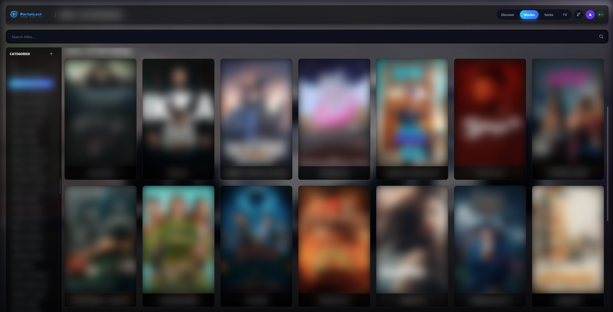
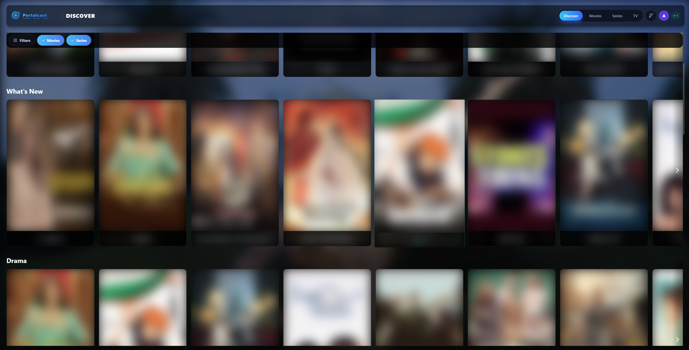
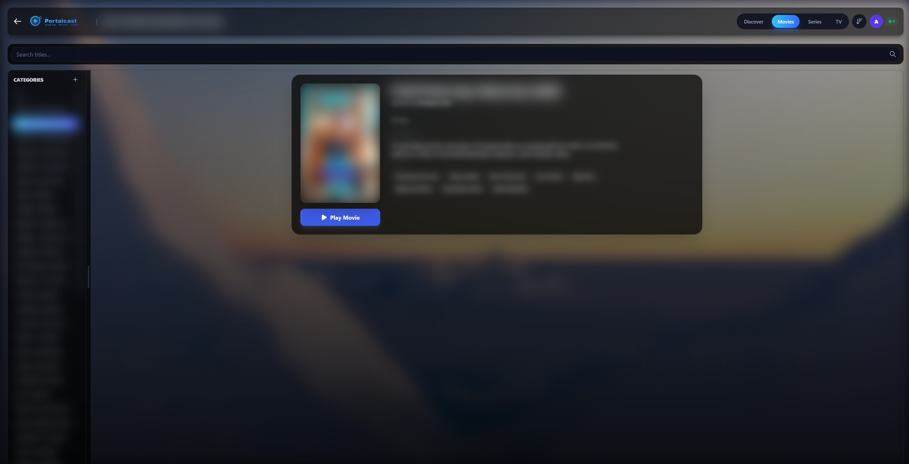
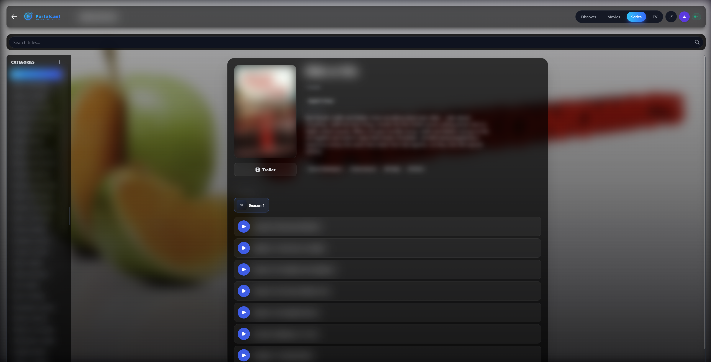
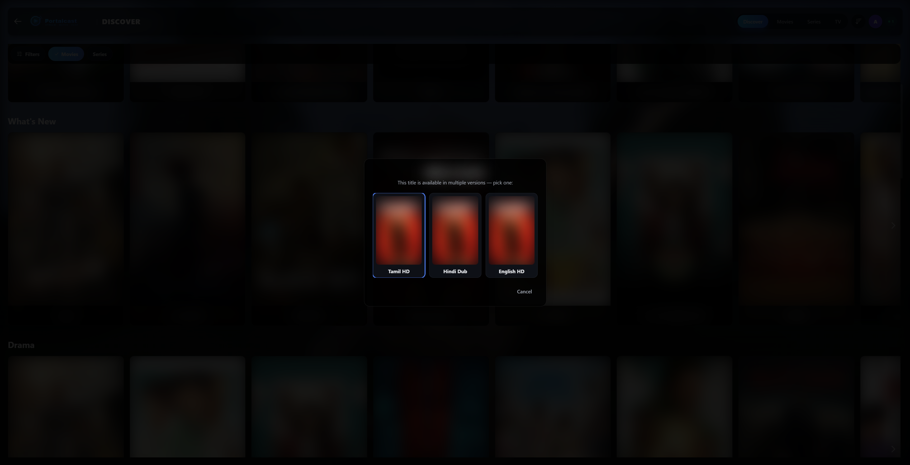
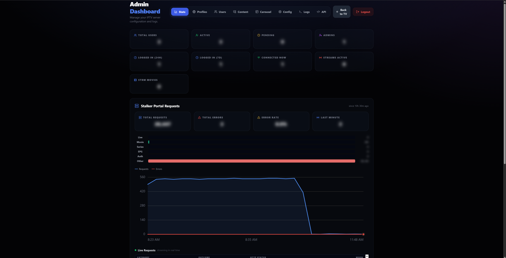

<p align="center">
  
</p>

<h1 align="center">Portalcast</h1>

<p align="center">
  A modern, feature-rich OTT/IPTV Player built with React, Vite, and TypeScript.<br/>
  Designed for performance, aesthetics, and broad device support including Tizen and WebOS.
</p>

<p align="center">
  
  
  
  
</p>

<p align="center">
  <a href="#-screenshots">Screenshots</a> ·
  <a href="#-features">Features</a> ·
  <a href="#-quick-start">Quick Start</a> ·
  <a href="#-deployment">Deployment</a> ·
  <a href="#-contributing">Contributing</a>
</p>

---

## 📸 Screenshots

<table>
  <tr>
    <td width="50%">
      
      <p align="center"><sub>Movies browse grid</sub></p>
    </td>
    <td width="50%">
      
      <p align="center"><sub>Discover — genre rows &amp; filters</sub></p>
    </td>
  </tr>
  <tr>
    <td width="50%">
      
      <p align="center"><sub>Movie details</sub></p>
    </td>
    <td width="50%">
      
      <p align="center"><sub>Series details &amp; episode list</sub></p>
    </td>
  </tr>
  <tr>
    <td width="50%">
      
      <p align="center"><sub>Multi-version picker (language/quality variants)</sub></p>
    </td>
    <td width="50%">
      
      <p align="center"><sub>Admin Dashboard</sub></p>
    </td>
  </tr>
</table>

<sub>Poster art, titles, cast, channel/category names, and admin stats are blurred in these screenshots — the UI chrome (nav, layout, buttons, colors) is left sharp so the design is still visible.</sub>

> Don't see images above? Drop screenshots into `docs/screenshots/` — see [docs/screenshots/README.md](docs/screenshots/README.md) for the exact filenames expected.

## ✨ Features

| | |
|---|---|
| 📺 **Live TV & VOD** | Seamless playback of live channels and video-on-demand content, with EPG (program guide) sync and automatic HLS error recovery |
| 🧭 **Discover** | A TMDB-enriched recommendation surface layered on top of your portal's own catalog — "Because You Watched" recommendations, progressively-loading genre rows, filterable browsing by genre/country/language/theme, and a variant picker for titles with multiple dubbed/subtitled versions |
| 📱 **Cross-Platform** | Optimized for customized web browsers, Samsung Tizen, and LG WebOS. Installable as a PWA with offline app-shell caching |
| 📡 **Casting Support** | Built-in casting capability to stream content to other devices |
| 💬 **Subtitles** | Embedded-track detection for progressive video, online subtitle search, and manual `.srt`/`.vtt` upload |
| 🎨 **Modern UI** | Polished, glassmorphic design with smooth animations, ambient backdrops, and responsive layout |
| 🔐 **Secure Stream Proxy** | Hides upstream credentials using a dedicated proxy server |
| 📝 **Favorites & History** | Manage your favorite channels and track watch history, with Continue Watching across movies and series |
| 🛠️ **Admin Dashboard** | Stats, user management, content overrides, homepage carousel, provider config, and live server log streaming — all from `/admin` |

## 🚀 Quick Start

### Prerequisites

- Node.js (v18+)
- npm or yarn
- A running [portalcast-server](https://github.com/) instance to connect to (this repo is the frontend only)

### Installation

1. **Clone the repository**

   ```bash
   git clone https://github.com/yourusername/portalcast-webui.git
   cd portalcast-webui
   ```

2. **Install dependencies**

   ```bash
   npm install
   ```

3. **Configure environment**

   Copy the example environment file and point it at your backend:

   ```bash
   cp .env.example .env
   ```

   Edit `.env`:

   ```ini
   # Set this to your Portalcast server IP
   VITE_API_HOST=http://YOUR_SERVER_IP:3000

   # Deployment targets
   TIZEN_DIR=/path/to/tizen/project/public
   SERVER_DIR=../portalcast-server/public
   ```

4. **Run the dev server**

   ```bash
   npm run dev
   ```

5. **Build for production**

   ```bash
   npm run build
   ```

   This compiles TypeScript and bundles the app into `dist/`. Building for a backend hosted elsewhere? Prepend the env var: `VITE_API_HOST=http://YOUR_SERVER_IP:3000 npm run build`.

## 🛠️ Deployment

A consolidated `deploy.sh` script handles builds for different environments. Both modes run the same production build — only `VITE_API_HOST` changes, baked in at build time.

<details>
<summary><b>Option 1 — Deploy to Server (default)</b></summary>

Builds the app using relative API paths and deploys to the configured `SERVER_DIR`. Best when the app is served from the *same* origin as the API.

```bash
./deploy.sh
```

</details>

<details>
<summary><b>Option 2 — Deploy to Tizen TV</b></summary>

Builds the app with a hardcoded server IP (from your `.env`) and deploys to the configured `TIZEN_DIR`. Best for Tizen Studio or side-loading.

```bash
./deploy.sh --tizen
```

</details>

Either mode:

1. Reads your configuration.
2. Builds the Vite project.
3. Deploys the `dist/` artifacts to your configured `DEPLOY_DIR` (default: `../portalcast-server/public`).

## ⚠️ Disclaimer

This application is a **media player only**. It does not provide, host, or distribute any video content, playlists, or streams. Users must provide their own content from legal and authorized sources (e.g., their own Stalker Middlewares or Xtream Codes subscriptions). The developers are not responsible for how this application is used.

## 🤝 Contributing

Contributions, issues, and feature requests are welcome!

1. Fork the project
2. Create your feature branch (`git checkout -b feature/AmazingFeature`)
3. Commit your changes (`git commit -m 'Add some AmazingFeature'`)
4. Push to the branch (`git push origin feature/AmazingFeature`)
5. Open a Pull Request

## 📄 License

Distributed under the MIT License. See [`LICENSE`](LICENSE) for more information.
